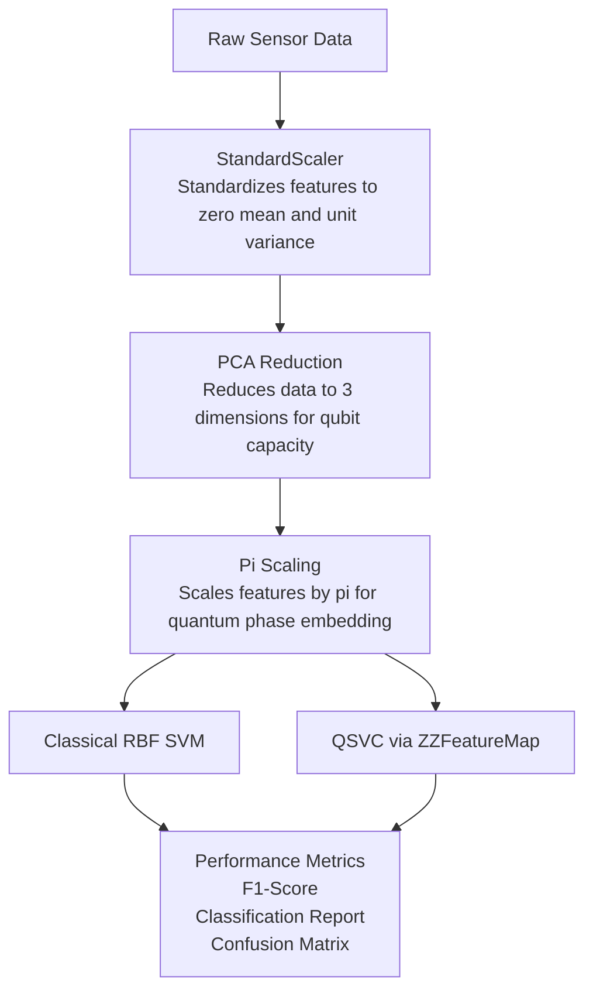

# Quantum-Enhanced Sensor Classification

A hybrid quantum-classical machine learning pipeline built to classify sensor readings (such as soil moisture and pump states for smart irrigation systems). This project implements and compares a classical Support Vector Machine (SVM) against a **Quantum Support Vector Classifier (QSVC)** using a quantum kernel to evaluate potential quantum advantages in low-dimensional sensor data classification.

---

## 1. Project Summary
The core objective of this project is to implement an end-to-end pipeline that transforms raw engineering/environmental sensor data into quantum states for classification. By utilizing a quantum feature map, classical data is projected into a high-dimensional quantum Hilbert space where linear separation might become optimal. 

The pipeline handles data preprocessing, feature reduction via Principal Component Analysis (PCA), quantum state embedding, and comparative model evaluation between an RBF-kernel classical SVM and a Qiskit-powered QSVC.

---

## 2. System Architecture & Workflow

The machine learning pipeline consists of the following modular phases:
## System Flow

## 3. Detailed Component Breakdown

### A. Data Preprocessing & Dimensionality Reduction
* **Train-Test Split:** The dataset is split into a 70/30 training and testing ratio, stratified by the target label (`Pump Data`) to handle potential class imbalances.
* **Feature Scaling:** `StandardScaler` standardizes the feature space, which is critical for distance-based algorithms like SVMs.
* **PCA (Principal Component Analysis):** Reduces the feature dimensions to 3 components. This serves two purposes: it retains the maximum possible variance while compressing the feature space to directly map onto a 3-qubit quantum simulator system.

### B. Classical Baseline Model
* **Algorithm:** Support Vector Classifier (SVC) utilizing a Radial Basis Function (**RBF**) kernel.
* **Optimization:** Hyperparameter tuning (C and gamma) is performed using a `GridSearchCV` with 3-fold cross-validation, optimizing for the F1-score.

### C. Quantum Kernel SVM (QSVC)
* **Feature Scaling for Quantum:** The PCA-transformed features are multiplied by pi. This scales the continuous data to fit appropriately within the periodic [0, 2*pi] phase rotation space of quantum gates.
* **Quantum Feature Map:** Uses the `ZZFeatureMap` with 1 repetition and linear entanglement. This translates the classical 3D data points into a high-dimensional quantum Hilbert space by introducing non-linear feature interactions.
* **Quantum Kernel:** A `FidelityQuantumKernel` evaluates the overlap (fidelity) between quantum states to construct the quantum kernel matrix, which is then used by the `QSVC` to find the optimal separating hyperplane.
